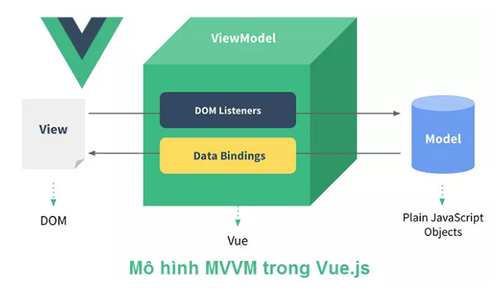
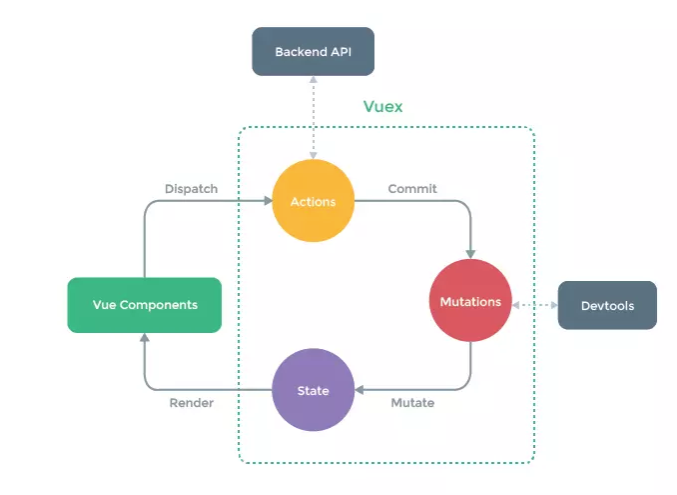
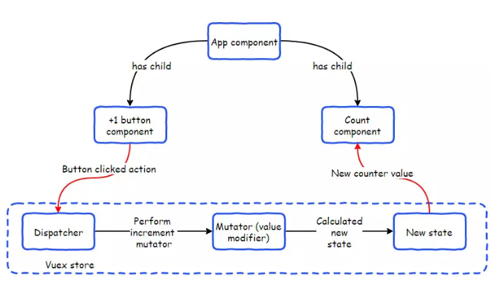

# learn-vue-in-one-project

## Project setup
```
npm install
```

### Compiles and hot-reloads for development
```
npm run serve
```

### Compiles and minifies for production
```
npm run build
```

### Lints and fixes files
```
npm run lint
```

### Customize configuration
See [Configuration Reference](https://cli.vuejs.org/config/).


### So sánh vuejs và reactjs kha tương đồng
Data  = state
VueX = Redux
Vue router = router
Component = Component
props = props

1. Cài đặt vuejs
- Cài nodejs + npm
	`npm -v`
- Vue cli:
	`npm install -g @vue/cli`

### Life Cycle Hook
    
    Nhưng phần bôi đỏ là phần hook
    - mount: gắn object lên html

### Cấu trúc thư mục
    src: source code
        - main.js -> file gốc
        - App.vue -> component gốc
        - assets -> hình ảnh, font chữ
        - components -> chứa các component con
    component:
        3 thành phần:
            - Template: html -> hiển thị
            - script: js -> xử lý
            - style: css -> làm đẹp
                - Hỗ trợ scss
                - scoped style: style dành riêng cho component
                `style scoped`
    root element:
        app

### Document vuejs
    - Binding dữ liệu 2 chiều
    - Phụ thuộc vào kiểu element
        - value binding: {{}}
        - property binding:
        - v-bind: [tên thuộc tính] = "tên biến"
            + Viết tắt: dấu `:`
        - style and class binding:
            :class: 
        - v-on: [tên sự kiện] = "func name()"
            + Viet tắt @
        - Prevent default event:
            + HUy bo event mac dinh cua element di
        - v-debounce:[time]=myFunc
        - `ref="channelName"` -> this.$ref.channelName
    - Conditional rendering
        - v-show: ẩn hiện element theo điều kiện
        - v-hide: Ngược lại v-show
        - v-if: ẩn hiện element theo điều kiện
        - v-el:
    - List rendering
        + v-for

    - methods: Các hàm của vuejs

    - watch: Theo dõi sự thay đổi của data

    - filters: {

    }
## Lib
    VeeValidate

## Call api
    # Dùng NPM
    `
        $ npm install axios --save
    `

## Vue router:
    https://viblo.asia/p/vue-router-trong-vue3-1VgZvrV9ZAw

## Vue store with vuex
	https://learnvue.co/tutorials/vuex-in-vue-3

</br>`Flux: Giải pháp luồng dữ liệu một chiều`

</br>`npm install vuex --save`


## scss
	```
	npm install sass-loader node-sass style-loader --save-dev
	```


## deployment
	```
        docker-compose up -d

        # Năm 2022 rồi thì dùng:
        docker compose up -d
    ```